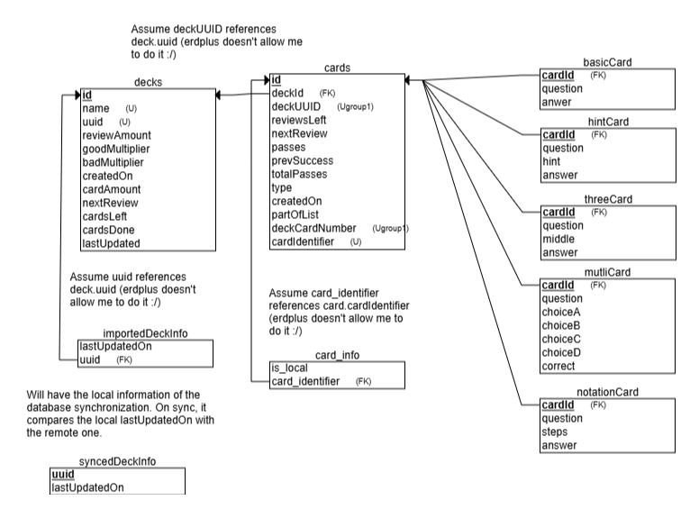
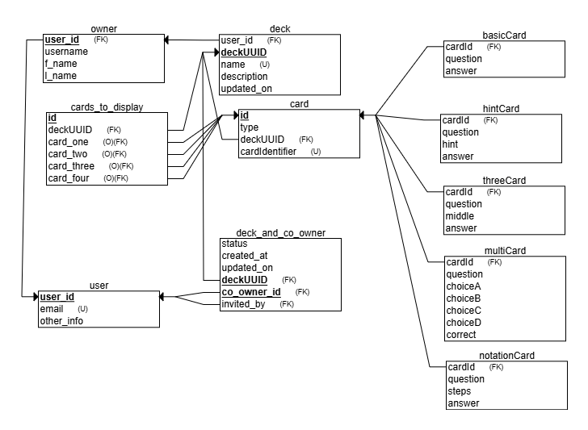
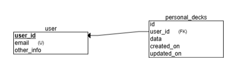

# Getting Started
## This application has 3 separate databases
### -  One is local SQLite using Room
### -  One is for sharing decks online with the community
### -  One is for syncing personal decks (not yet implemented)

## Here is the schema of how the databases are connected.

### Local DB

#### Explanation 
- TODO

### Community DB

 #### Explanation
- TODO

### Synced/Remote DB (Not yet implemented to the application)

#### Explanation
- TODO

